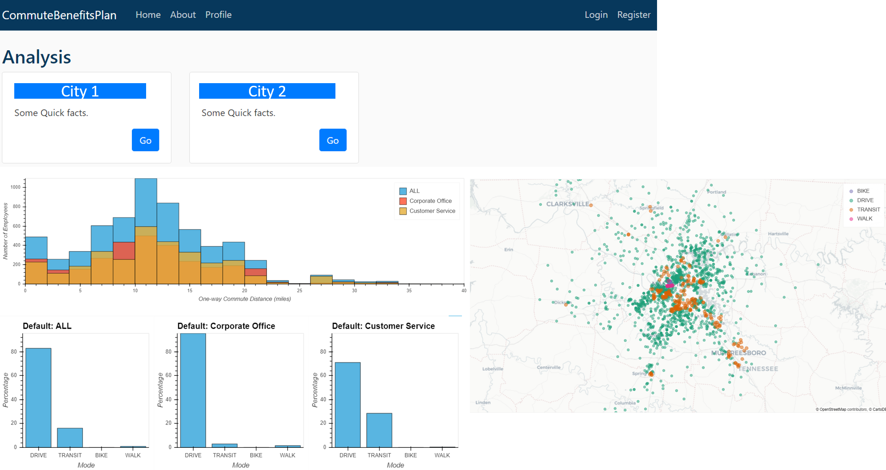
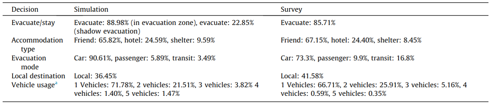
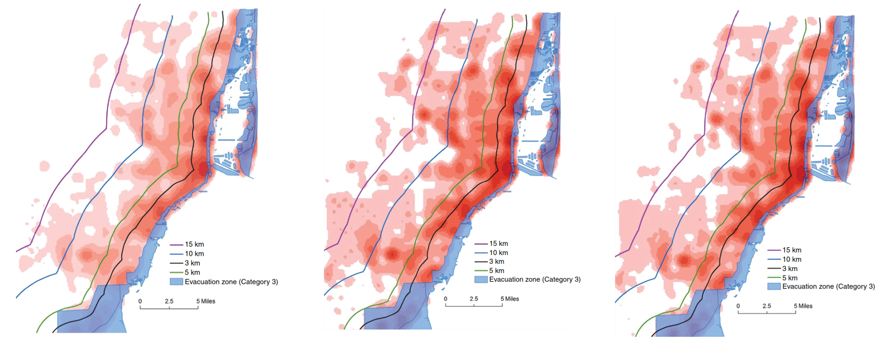
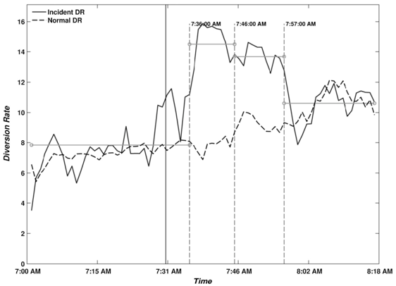

# Projects

## Data Science

###  Employee Commuting Mode Choice

* _**Objective**_: Predict the mode of commuting trips and use the predictions to explore various commuting subsidy policies.
*  _**Data**_: Coordinate pairs describing home and work locations. 
* _**Models**_: 
   * Logistic regression model.
*  _**Tools**_: Python / Flask
* _**Design**_:  
   * The project has two components.
     * The backend first obtains the routes for driving and transit for each OD by querying Google Directions API and then a predictive model 
     * The predictive model is used to forecast the mode for each trip. 
     * The frontend is built with Flask with embedded Bokeh visualizations. 
* _**Application**_: Various cities.  
   

###  TNC Rider Churn

* _**Objective**_: Predict rider churn.

## Software

###  ConvertTrips 

* _**Objective**_: This program produces detailed travel itineraies for about 19 million trips based on input origin-destination trip estimates and departure time distribution.
*  _**Design**_: A console program that takes a control file as an input which specifies processing parameters as key-value pairs. 
*  _**Tools**_: Python / Cython
* _**Application**_: Houston.

## Research on Travel Behavior

Here are some selected publications. See all of my publications in [Google Scholar](https://scholar.google.com/citations?user=Kkq8saIAAAAJ&hl=en).

###  Estimate Evacuation Demand for a Region   
* _**Objective**_: Predict the travel demand including evacuation preparations and final evacuation.
*  _**Data**_: Surveys
* _**Models**_: 
   * Logistic regression model.
   * Survival model
   * Generalized linear model
*  _**Tools**_: C++
* _**Takeaways**_:  
   * The model is able to produce travel plans that detailed the evacuation preparations such as withdrawing money and buy food. The distributions of evacuation decisions, when aggregated, are close to surveys.  
   
* _**Application**_: Miami.  
* _**Publication**_:   
**An agent-based modeling system for travel demand simulation for hurricane evacuation**  
Weihao Yin, Pamela Murray-Tuite, Satish Ukkusuri, Hugh Gladwin  
Transportation Research Part C: Emerging Technologies 42, 44-59 (2014)  
[DOI](doi.org/10.1016/j.trc.2014.02.015) | [Blog](./_posts/2015-02-28-test-markdown.md)

###  Impute Missing Data in Freeway Traffic Volume Data   
* _**Objective**_: Compare and Contrast different imputation schemes for traffic volume data.
*  _**Data**_: Loop detector time-series data
* _**Models**_: 
   * Linear regression model and Kernal regression model.
   * The models are compared using MAPE and MAE
*  _**Tools**_: SQL
* _**Takeaways**_:  
   * The regression model using the temporal features shows the best performance.  
* _**Application**_: Interstate-66 in Virginia.  
* _**Publication**_:   
**Imputing erroneous data of single-station loop detectors for nonincident conditions: Comparison between temporal and spatial methods**  
Weihao Yin, Pamela Murray-Tuite, Hesham Rakha  
Journal of Intelligent Transportation Systems 16(3), 159-176 (2012)  
[DOI](doi.org/10.1080/15472450.2012.694788) | [Blog]()

###  Predicting Households' Evacuate/Stay Decision with Hurricane Approaching  
* _**Objective**_: Predict if a household evacuates or stay when a hurricane is approaching.
*  _**Data**_: Stated-preference survey
* _**Model**_: Mixed-effect logistic regression 
*  _**Tools**_: 
* _**Takeaways**_:  
   * Contributing factors that influence evacuation decisions include: house protective measures, business ownership, pet, demographics, distance to the coast, receipt of evacuation notice. 
   * Households respond to the voluntary evacuation notice differently due to their different risk perception. 
   * The risk perception is linked to the household location to the coast. The following figure shows the evacuation demand under different levels of risk perception.  
   
* _**Application**_: Miami-Dade county evacuation study  
* _**Publication**_:   
**Modeling shadow evacuation for hurricanes with random-parameter logit model**  
Weihao Yin, Pamela Murray-Tuite, Satish Ukkusuri, Hugh Gladwin  
Transportation Research Record 2599(1), 43-51 (2016)  
[DOI](doi.org/10.3141/2599-06) | [Blog](./_posts/evacuate-stay.md)

###  Predicting Diversion Traffic When Traffic Accidents Occur   
* _**Objective**_: Predict if traffic would divert from freeway to parallel arterial when accidents occur.
*  _**Data**_: Loop detector time-series data and Incident records for along I-66
* _**Models**_: 
   * A dynamic programming based algorithm is implemented to identify the surge of ramp volume. The segments are constructed by minimizing within-segment sum of squared deviation from the segment mean.
   * A logistic regression model is used to estimate the probability of diversion.
   * A linear regression model is used to estimate the magnitude of the diversion traffic.  
*  _**Tools**_: 
* _**Takeaways**_:  
   * The traffic volume on the off-ramp to the parallel road surges after the accident occurs and later subsides to normal after 30 minutes as shown in the figure below.  
      
   * Travelers are more likely to divert to a different road under severe accident. Trips on weekends are more likely to divert. 
* _**Application**_: Interstate-66/US-50 corridor in Virginia.  
* _**Publication**_:   
**Incident-induced diversion behavior: Existence, magnitude, and contributing factors**  
Weihao Yin, Pamela Murray-Tuite, Kris Wernstedt  
Journal of Transportation Engineering 138(10), (2012)  
[DOI](doi.org/10.1061/(ASCE)TE.1943-5436.0000431) | [Blog]()

###  Predicting Number of Vehicles Used in an Evacuation   
* _**Objective**_: Predict how many vehicles a household would use for an evacuation.
*  _**Data**_: Survey
* _**Models**_: 
   * Generalized Linear Model  
*  _**Tools**_: 
* _**Takeaways**_:  
   * The traffic volume on the off-ramp to the parallel road surges after the accident occurs and later subsides to normal after 30 minutes as shown in the figure below.  
   * Travelers are more likely to divert to a different road under severe accident. Trips on weekends are more likely to divert. 
* _**Application**_: Interstate-66/US-50 corridor in Virginia.  
* _**Publication**_:   
**Statistical analysis of the number of household vehicles used for Hurricane Ivan evacuation**  
Weihao Yin, Pamela Murray-Tuite, Hugh Gladwin  
Journal of Transportation Engineering 140(12), (2012)   
[DOI](doi.org/10.1061/(ASCE)TE.1943-5436.0000713) | [Blog]()

